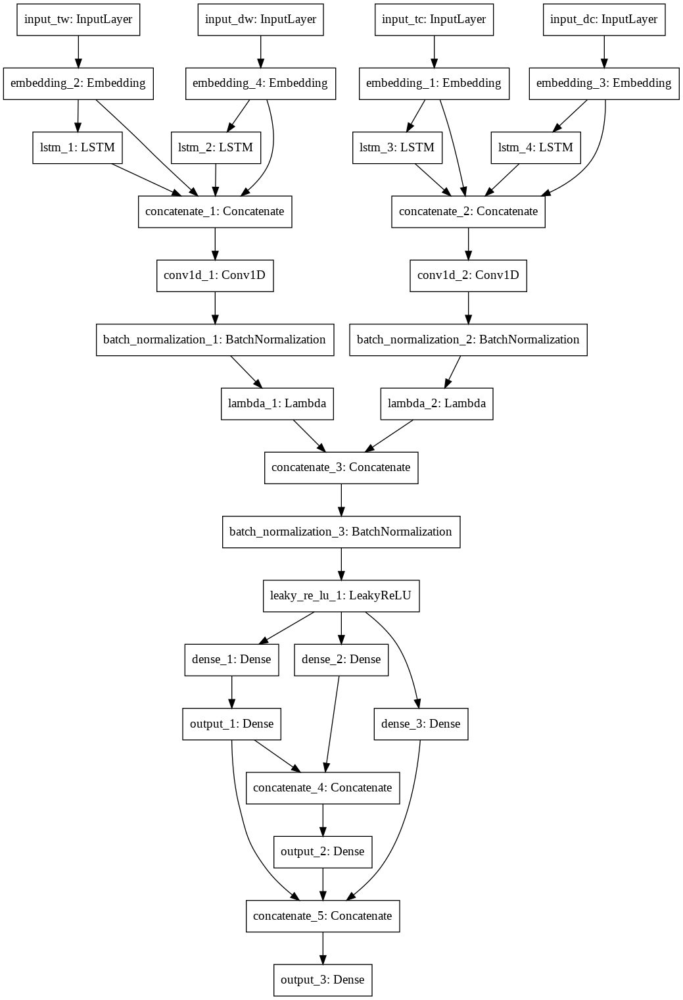
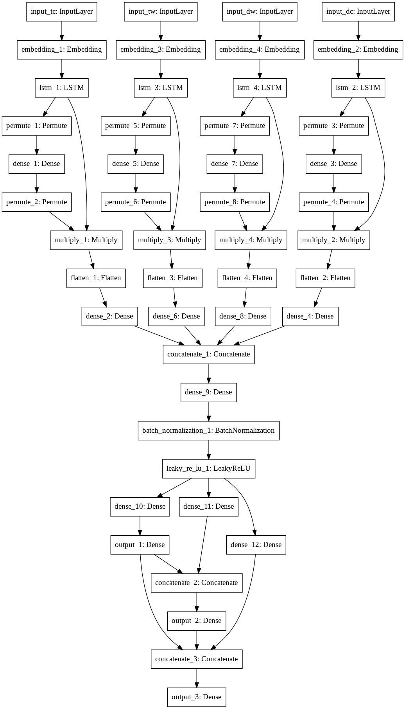

# 种子杯复赛报告
队名：民间AI科学技术小组
组长:杜欣伟
组员:周振宇 周楚阳

分数: 0.8643   f1_cate1: 0.9552   f1_cate2: 0.8898   f1_cate3: 0.8364
### 1.运行环境及语言
- python 3.5
- tensorflow 1.11
- keras
- numpy/pandas等

使用一块Tesla P100 GPU及一块Tesla K80 GPU

### 2. 接口与特殊变量含义
**五个文件代表五个结构不同的模型，全部写成jupyter文件，线性顺序执行下来即可。**
- 接口
```
getX(columnName,featureNum,word_id,haveA = True) # 获取特征X
getY(cate_name,cate,haveA = True) # 获取特征Y
reset_tf_session() # keras 构建网络的辅助函数 用于清空不用信息
GetF1(Callback) # 获取F1
model_Save(epoch,v1,v2,v3) # 保存模型，并在文件名字中加上val上F1结果
measureVal(model) # 评价val集上的F1
deOneHot(result,cate=None) # 将独热编码的y改为其原本取值
predictTest(model,saveName = None) # 预测test结果并保存结果

```
- 特殊变量含义：
```
FEATURE1_LEN = 40 # 标题字训练样本长度
FEATURE2_LEN = 25 # 标题词训练样本长度
FEATURE3_LEN = 115 # 描述字训练样本长度
FEATURE4_LEN = 70 # 描述词训练样本长度
EMBEDDING_DIM_CHAR = 200 # 字的embedding长度
EMBEDDING_DIM_WORD = 200 # 词的embedding长度
CHAR_DIM = 4794 # 字库长度
WORD_DIM = 65874 # 词库长度
START_EPOCH = 0 # 训练开始时的周期取值
EPOCH = 15 # 训练周期
MODEL_SAVE = True # 是否每个epoch结束时保存模型
```
### 3. 特征提取思路
#### 3.1 **对于X**
- 统计所有样本中，字的出现频率并排序
- 根据排序分别给字编号，最常出现的字编号为1，次之为2，以此类推。出现频率小于等于五的所有字统一给一个编号。
- 对词做同样的操作
- 分析所有样本的标题字、标题词、描述字、描述词长度，选择合适的截取长度（长度大于95%的样本长度）。
- 经过上诉分析后，将原本样本中的字、词根据其编号改为数字。长度统一设置成标题字40，标题词25，描述字115，描述词70。过长则截取，不足则补零
```
X取值案例
train_X1[0] = array([ 36,  23,  31,  25,   5,   3, 229,  14,  16,   3, 199, 230,  14,
        86, 758, 499, 849,  14, 849, 166, 857, 258,  14,   0,   0,   0,
         0,   0,   0,   0,   0,   0,   0,   0,   0,   0,   0,   0,   0,
         0])
train_X2[123] = array([2391, 4360,  213,    3,  236, 1091,    6,  174,    0,    0,    0,
          0,    0,    0,    0,    0,    0,    0,    0,    0,    0,    0,
          0,    0,    0])
```
**字、词各有一个200维的embedding，随机初始化，跟着神经网络一起训练**

#### 3.2 **对于y**
- 将三个类目的编号统一改成，类目一0-19，类目二0-134，类目三0-264
- 对y进行独热
```
y取值案例
train_y1_hot[0] = array([1., 0., 0., 0., 0., 0., 0., 0., 0., 0., 0., 0., 0., 0., 0., 0., 0.,
       0., 0., 0.])
```
### 4. 预测模型选择
模型追求多个模型好而不同。我们共搭建了五个模型(部分模型名字为自取的)
- BiLSTM
- Bi-Gru-Attention
- CNNText
- RCNN
- LSTM-ATTENTION
#### 4.1 BiLSTM
双向lstm网络模型，字词分别embedding，能够将one-hot编码进行压缩和特征提取，然后分别通过一层双向的lstm层，双向能够更好地获取上下文地特征，再进行连接，通过batchnorm正则化，防止过拟合，之后再通过梯形输出分类结果，梯形能够利用前面输出类别更准确输出当前分类结果
#### 4.2 Bi-Gru-Attention
双向GRU注意力模型，字词分别embedding，能够将one-hot编码进行压缩和特征提取，然后分别通过一层双向的GRU层，双向能够更好地获取上下文地特征，再通过一层注意力层，注意力层能够更好地分配句子中每个字或词对结果的影响，再进行连接，通过batchnorm正则化，防止过拟合，之后再通过梯形输出分类结果，梯形能够利用前面输出类别更准确输出当前分类结果
#### 4.3 CNNText
卷积网络模型，字词分别embedding，能够将one-hot编码进行压缩和特征提取，然后通过两层卷积层和最大化池层，卷积层和最大化池合用可以更好地进行特征提取，再进行连接，再通过两次batchnorm，防止过拟合，再通过梯形输出分类结果，梯形能够利用前面输出类别更准确输出当前分类结果
#### 4.4 RCNN
循环卷积神经网络模型，字词分别通过lstm后与各自的embedding层相接，这样就获取了上下文周围词的信息。之后通过一维卷积层，最大池化层进一步提取特征，字词信息融合后用BN层正则化，通过梯形模型分类得出结果。

#### 4.5 LSTM-Attention
注意力模型，通过lstm网络后，与通过Dense层得到的注意力权重相乘，用之前的结果来辅助之后的判断，实现注意力机制。这里分别对标题字，标题词，描述字，描述词做了注意力训练后再融合，通过梯形分类器得到结果。

### 5. 模型参数选择与优化思路
#### 5.1 训练思路
- 使用Adamax(lr=0.01)，初始设batch_size为1024，每轮epoch训练完毕后检查val集上的f1值（不以loss为评价标准），并保存模型。
- 当val上的f1不再提升时，读取上一个epoch时模型的数据，将batch_size缩短一半，继续训练。batch_size最低到128。

#### 5.2 模型参数选择
- **标题字、标题词、描述字、描述词的长度取值**：统计所有样本的长度，选择覆盖95%以上的长度
- **embedding长度选择**：200，参考目前常见的embedding在100-300之间。
- **三个类目损失占比**：总损失=一类目损失 x 0.1 + 二类目损失 x 0.3 + 三类目损失 x 0.8。第三个类目损失设为0.8而不是0.6，是希望模型对第三个类目更加重视一些。
### 6. 预测结果方法
#### 6.1 单个模型内的融合
- 每进行一轮，预测val集上损失、准确率以及F1损失，并及时保存模型。
- 选项在val集上F1最大的模型，我们称其为**基准模型**。
- 共预测5次：
    1. 导入基准模型，预测test集上结果。
    2. 导入基准模型，设batch_size为1024，在val集上跑一轮，预测test集上结果。
    3. 导入基准模型，设batch_size为1024，在val集上跑两轮，预测test集上结果。
    4. 导入基准模型，设batch_size为512，在val集上跑一轮，预测test集上结果。
    5. 导入基准模型，设batch_size为256，在val集上跑一轮，预测test集上结果。
- 采用投票方式，得出单个模型的融合结果。
#### 6.2 不同模型之间的融合
- 五个不同的模型，均经过6.1单个模型内融合后，获得五个预测文件。
- 根据投票方式，对这五个文件，选择出现次数最多的结果。
#### 6.3 人为规则修改
- 根据类目树的特性，人为编写三条逻辑（见embedding.ipynb第二部分），更改类目一、二、三不符合此规则的样本的取值。

### 7. 未完成的想法
以下观点仅为设想，由于时间有限，未能实现，不知效果如何。
- 统计样本的LDA,TF-IDF,N-GRAM等特征，然后采用机器学习方法+stacking的方法，获得一到两个结果文件，与之前深度学习预测的结果文件进行投票。
- 采用预训练的embedding，word2vec(skip-gram方法)和glove各训练100维，二者一起拼接成一个200维度的embedding字（词）
- 不讲字、词同时作为输入，而是分成两个网络各自单独训练。